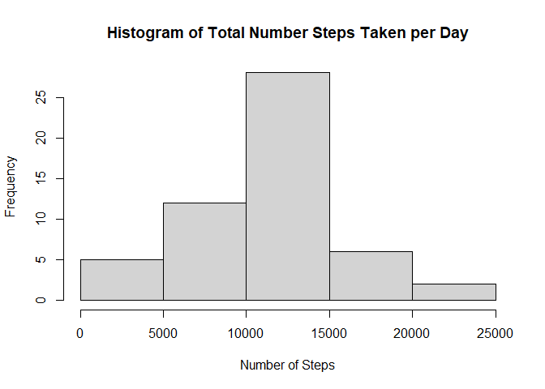
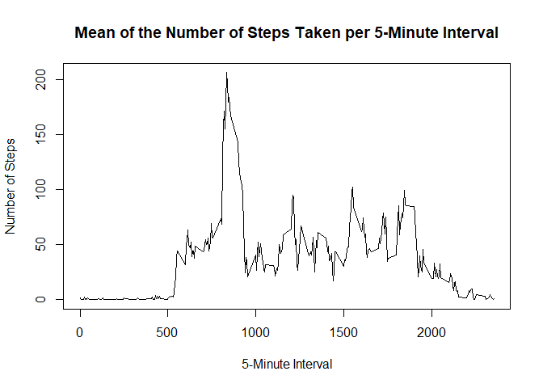
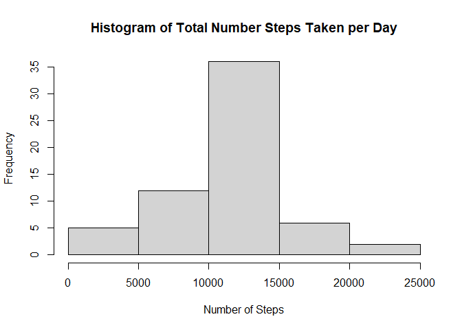
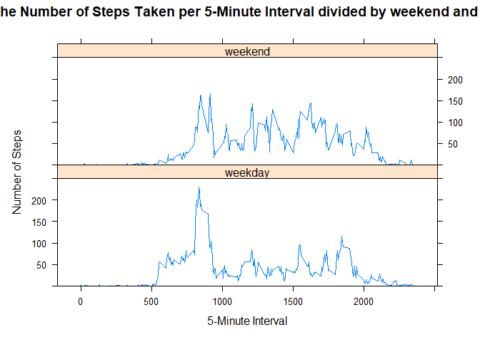

**Load and format data**


```r
tmp <- tempfile()
tmp2 <- tempfile()
url <- "https://github.com/MrIsabel/RepData_PeerAssessment1/raw/master/activity.zip"

download.file(url, tmp, mode = "wb")
unzip(zipfile = tmp, exdir = tmp2)
activity <- read.csv(file.path(tmp2, "activity.csv"))

unlink(c(tmp, tmp2))

activity$date <- as.Date(activity$date, format = "%Y-%m-%d")
```

**Calculate the total number of steps taken per day and draw histogram**


```r
totalstepsday <- aggregate(activity$steps, list(activity$date), sum)
colnames(totalstepsday) <- c("day", "sumsteps")
hist(totalstepsday$sumsteps, xlab = "Number of Steps", main = "Histogram of Total Number Steps Taken per Day")
```

<!-- -->

**Calculate the mean and median of the number of steps taken per day**


```r
meansteps <- format(round(mean(totalstepsday$sumsteps,  na.rm = TRUE), digits = 2), scientific = FALSE)

mediansteps <- median(totalstepsday$sumstep, na.rm = TRUE)
```

The mean of the total number of steps taken per day is 10766.19 and the median is 10765.

**Calculate the mean of the number of steps taken per 5-minute interval and draw graph**


```r
meanstepsint <- aggregate(activity$steps, list(activity$interval), mean, na.rm = TRUE)
colnames(meanstepsint) <- c("interval", "meansteps")
meanstepsint$meansteps <- round(meanstepsint$meansteps, digits = 2)

plot(meanstepsint, type = "l", xlab = "5-Minute Interval", ylab = "Number of Steps", main = "Mean of the Number of Steps Taken per 5-Minute Interval")
```

<!-- -->

**Find maximum average number of steps per 5-minute interval**


```r
maxsteps <- max(meanstepsint$meansteps, na.rm = TRUE)
maxint <- meanstepsint[meanstepsint$meansteps == maxsteps, 1]
```

The maximum average of number of steps per 5-minute interval is 206.17 located in the 835 interval.

**Calculate the number of NA values**


```r
totalna <- sum(is.na(activity$steps))
```

The total NA values is 2304.

**Impute NA values with the average number of steps taken per 5-minute interval and draw new histogram**


```r
newactivity <- activity
k <- dim(newactivity)[1]

for (i in 1:k){
  
  if (is.na(newactivity$steps[i])){
    
    newactivity$steps[i] <- meanstepsint$meansteps[meanstepsint$interval == newactivity$interval[i]]
  
  }
  
}
newtotalstepsday <- aggregate(newactivity$steps, list(newactivity$date), sum)
colnames(newtotalstepsday) <- c("day", "sumsteps")
hist(newtotalstepsday$sumsteps, xlab = "Number of Steps", main = "Histogram of Total Number Steps Taken per Day")
```

<!-- -->

**Calculate the mean and median number of steps taken per day with the imputed data**


```r
newmeansteps <- format(mean(newtotalstepsday$sumsteps,  na.rm = TRUE), scientific = FALSE)

newmediansteps <- format(median(newtotalstepsday$sumstep, na.rm = TRUE), scientific = FALSE)
```

The mean of the total number of steps taken per day is 10766.18 and the median is 10766.13. There are only small change with the method chosen for imputing NA values.

**Calculate the mean of the number of steps taken per 5-minute interval and separate the data by weekend and weekday and draw graph**


```r
library(lattice)

for (j in 1:k){
  
  if(weekdays(newactivity$date[j]) %in% c("Saturday", "Sunday")){
    newactivity$week[j] <- "weekend"
  } 
  else{
    newactivity$week[j] <- "weekday"
  }
  
}

weektotalstepsday <- aggregate(newactivity$steps, list(newactivity$interval, newactivity$week), mean)
colnames(weektotalstepsday) <- c("interval", "week", "meansteps")
weektotalstepsday$meansteps <- round(weektotalstepsday$meansteps, digits = 2)

xyplot(meansteps~interval|week, data = weektotalstepsday, type = "l", layout = c(1,2), ylim = c(0,250), ylab = "Number of Steps", xlab = "5-Minute Interval", main = "Mean of the Number of Steps Taken per 5-Minute Interval divided by weekend and weekday")
```

<!-- -->
